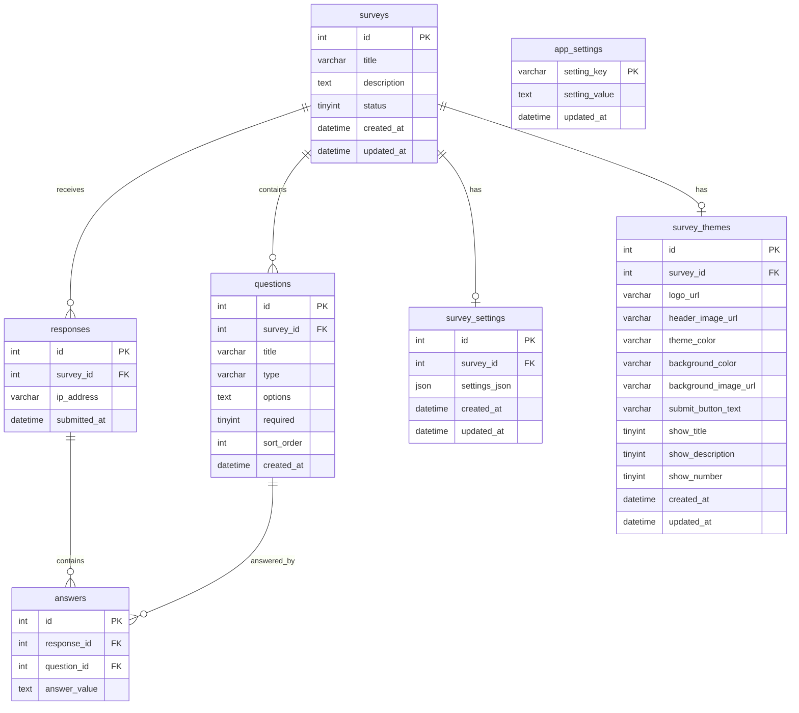
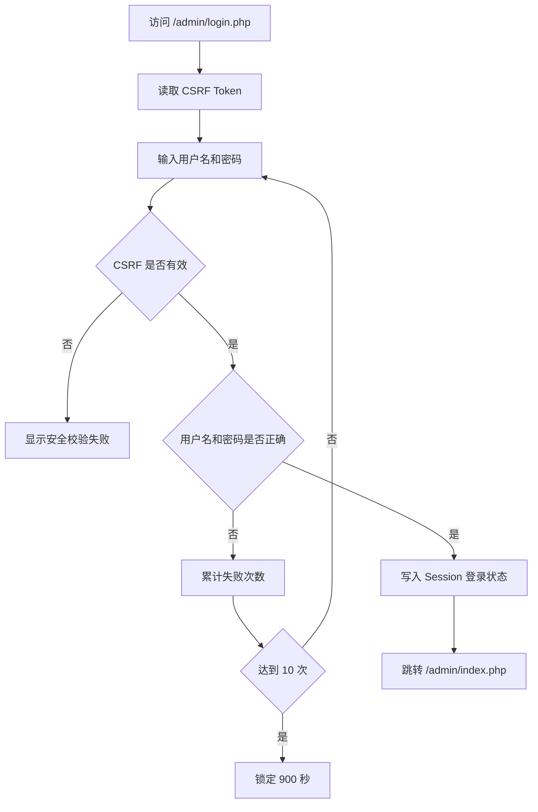
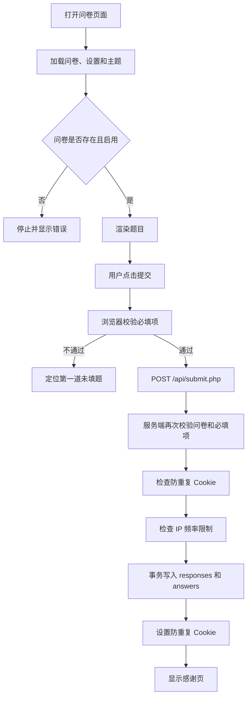
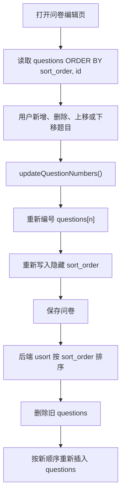

# test.gdmrcare.com 问卷系统交接文档

> 文档版本：1.0  
> 最后核对时间：2026-06-01（Asia/Shanghai）  
> 项目目录：`E:\VibeCoding\test.gdmrcare.com`  
> 当前技术形态：PHP + MySQL + 原生 HTML/CSS/JavaScript  
> 当前本地访问地址：`http://127.0.0.1:8089`

---

## 1. 文档用途

本文档用于把 `test.gdmrcare.com` 问卷系统完整交接给后续开发、部署或运维人员。内容以当前本地代码和当前 live MySQL 数据库为准，不以早期设计稿或旧版本说明为准。

本文档覆盖：

1. 当前项目状态和功能范围。
2. 本地运行环境和启动方式。
3. 目录结构与关键文件职责。
4. 数据库连接信息、表结构、数据关系和当前数据快照。
5. 前台填写、后台管理、二维码、统计、导出、品牌配置和图片上传流程。
6. 从 Tduck 参考项目迁移过来的能力。
7. 已验证项目、测试方式和验证结果。
8. 已知风险、编码注意事项、安全注意事项和后续优化建议。
9. 常用排查命令和故障处理方式。

---

## 2. 项目概览

这是一个轻量级问卷调查系统，适合单站点、小规模问卷收集和内部使用场景。项目没有引入 PHP 框架、Composer 依赖、前端构建工具或 Node.js 运行时。部署时只需要：

- PHP 8.x
- PDO MySQL 扩展
- MySQL 8.x
- Web 服务器或 PHP 内置开发服务器
- 可写的 `public/uploads/` 目录

当前系统支持：

- 管理员登录和退出。
- 后台仪表盘。
- 创建、编辑、启用、停用、删除问卷。
- 单选题、多选题、文本题。
- 必填题校验。
- 题目新增、删除、上移、下移和稳定排序。
- 问卷基础设置。
- 问卷主题设置。
- 系统名称、Logo、浏览器标题模板、站点基础地址和页脚版权配置。
- 系统 Logo 上传。
- 问卷 Logo、头图和背景图上传。
- 前台问卷填写和提交。
- 防重复提交 Cookie。
- 基于 IP 的提交频率限制。
- 回答数据列表。
- 选择题统计图表。
- CSV 导出。
- 问卷二维码生成和下载。

明确不在当前范围内：

- 微信公众号登录。后台只保留配置占位开关，当前版本不接入实际登录流程。
- 多管理员体系。
- 用户注册和权限分级。
- SQLite 存储。当前版本使用 MySQL。
- Tduck 原项目中的复杂 SaaS、多租户、协作、表单市场等能力。

---

## 3. 当前运行状态

### 3.1 本地服务

当前本地 PHP 服务正在运行：

```text
PHP 可执行文件：
D:\phpstudy_pro\Extensions\php\php8.2.9nts\php.exe

启动命令：
php -S 127.0.0.1:8089 -t public

项目目录：
E:\VibeCoding\test.gdmrcare.com

站点地址：
http://127.0.0.1:8089
```

当前机器还存在另一个 PHP 内置服务：

```text
php -S 127.0.0.1:8091
```

它不是本项目的主服务。排查端口时不要把 `8091` 与本项目的 `8089` 混淆。

### 3.2 MySQL

当前使用 PHPStudy 提供的 MySQL：

```text
MySQL 客户端：
D:\phpstudy_pro\Extensions\MySQL8.0.12\bin\mysql.exe

主机：
127.0.0.1

端口：
3400

数据库：
survey_system

用户名：
survey_system

密码：
feiLian855895

字符集：
utf8mb4
```

### 3.3 后台登录

当前本地开发环境后台账号：

```text
后台地址：
http://127.0.0.1:8089/admin/login.php

用户名：
admin

密码：
123456
```

注意：这是联调使用的弱密码。正式上线前必须替换为强密码，并更新 `app/config.php` 中的 `ADMIN_PASSWORD_HASH`。

---

## 4. 快速启动

### 4.1 前置条件

确认 PHPStudy 已启动 MySQL，并且 MySQL 正在监听 `3400` 端口。

确认 PHP 可执行文件存在：

```powershell
Test-Path D:\phpstudy_pro\Extensions\php\php8.2.9nts\php.exe
```

确认 MySQL 可执行文件存在：

```powershell
Test-Path D:\phpstudy_pro\Extensions\MySQL8.0.12\bin\mysql.exe
```

### 4.2 启动 MySQL

优先使用 PHPStudy 面板启动 MySQL 服务。

如果需要确认端口：

```powershell
netstat -ano | Select-String ":3400"
```

如果命令能看到监听项，说明 MySQL 已启动。

### 4.3 初始化数据库

首次部署时创建数据库和用户，然后执行根目录的 `database.sql`。

示例：

```powershell
D:\phpstudy_pro\Extensions\MySQL8.0.12\bin\mysql.exe `
  --default-character-set=utf8mb4 `
  --host=127.0.0.1 `
  --port=3400 `
  --user=survey_system `
  --password=feiLian855895 `
  --database=survey_system `
  < E:\VibeCoding\test.gdmrcare.com\database.sql
```

### 4.4 启动 PHP 开发服务器

在项目根目录执行：

```powershell
cd E:\VibeCoding\test.gdmrcare.com
D:\phpstudy_pro\Extensions\php\php8.2.9nts\php.exe -S 127.0.0.1:8089 -t public
```

如果需要后台运行：

```powershell
Start-Process `
  -FilePath "D:\phpstudy_pro\Extensions\php\php8.2.9nts\php.exe" `
  -ArgumentList "-S", "127.0.0.1:8089", "-t", "public" `
  -WorkingDirectory "E:\VibeCoding\test.gdmrcare.com" `
  -WindowStyle Hidden
```

### 4.5 访问地址

```text
前台问卷：
http://127.0.0.1:8089/index.php?id=3

短链接形式：
http://127.0.0.1:8089/survey/3

后台登录：
http://127.0.0.1:8089/admin/login.php

后台仪表盘：
http://127.0.0.1:8089/admin/index.php

问卷管理：
http://127.0.0.1:8089/admin/surveys.php

数据查看：
http://127.0.0.1:8089/admin/responses.php

二维码生成：
http://127.0.0.1:8089/admin/qrcode.php

系统设置：
http://127.0.0.1:8089/admin/system.php
```

---

## 5. 目录结构

```text
E:\VibeCoding\test.gdmrcare.com
├─ app
│  ├─ config.php
│  ├─ database.php
│  └─ functions.php
├─ includes
│  ├─ auth.php
│  ├─ footer.php
│  └─ header.php
├─ public
│  ├─ .htaccess
│  ├─ 404.html
│  ├─ index.html
│  ├─ index.php
│  ├─ nginx.htaccess
│  ├─ admin
│  │  ├─ index.php
│  │  ├─ login.php
│  │  ├─ logout.php
│  │  ├─ qrcode.php
│  │  ├─ responses.php
│  │  ├─ surveys.php
│  │  └─ system.php
│  ├─ api
│  │  └─ submit.php
│  ├─ assets
│  │  ├─ css
│  │  │  └─ style.css
│  │  └─ js
│  │     ├─ main.js
│  │     └─ qrcode.js
│  └─ uploads
│     ├─ system
│     └─ surveys
├─ .gitignore
├─ CODE_REVIEW.md
├─ database.sql
└─ PROJECT_HANDOVER.md
```

说明：

- `public/` 是 Web 根目录。
- `app/` 不应该直接暴露给 Web。
- `public/uploads/` 用于存储上传图片。
- `public/uploads/system/` 存储系统 Logo。
- `public/uploads/surveys/` 存储问卷 Logo、头图和背景图。目录会在首次上传时自动创建。
- `CODE_REVIEW.md` 是旧审查报告，可作为历史参考，但部分内容已过期。
- `PROJECT_HANDOVER.md` 是当前交接基准文档。

---

## 6. 核心文件职责

### 6.1 `app/config.php`

用途：

- 数据库连接常量。
- 后台用户名和密码哈希。
- 默认系统名称。
- 默认站点 URL。
- 提交频控参数。
- 登录锁定参数。
- 路径常量。
- Session Cookie 安全配置。
- 通用安全响应头。

关键参数：

```php
DB_HOST
DB_PORT
DB_NAME
DB_USER
DB_PASS
DB_CHARSET
ADMIN_USERNAME
ADMIN_PASSWORD_HASH
APP_NAME
SITE_URL
SUBMIT_COOKIE_EXPIRE
IP_LIMIT_WINDOW
IP_LIMIT_MAX
MAX_ANSWER_LENGTH
LOGIN_MAX_ATTEMPTS
LOGIN_LOCKOUT_SECONDS
```

当前限制：

- 配置文件内包含数据库密码和管理员密码哈希。
- `.gitignore` 已排除 `app/config.php`，但如果代码已被提交过，不能假设历史记录中没有敏感信息。
- 正式部署建议改为环境变量或独立私密配置文件。

### 6.2 `app/database.php`

用途：

- 通过 PDO 创建 MySQL 单例连接。
- 强制使用 `utf8mb4`。
- 启用异常模式。
- 禁止模拟预处理语句。

连接入口：

```php
getDB()
```

### 6.3 `app/functions.php`

用途：

- JSON 响应。
- HTML 转义。
- CSRF Token。
- 登录状态和失败次数控制。
- 问卷查询。
- 问卷设置和主题设置。
- 图片上传。
- 系统设置。
- 浏览器标题模板。
- 页脚。
- 二维码和预览链接生成。
- IP 提交频率限制。
- 日期格式化。

核心函数：

```php
jsonResponse()
e()
generateCSRFToken()
verifyCSRFToken()
requireLogin()
getSurveyWithQuestions()
getSurveySettings()
getSurveyTheme()
saveSurveySettings()
saveSurveyTheme()
handleUploadedImage()
getAppSettings()
saveAppSettings()
buildSurveyUrl()
renderAppFooter()
buildPageTitle()
checkIPSubmissionLimit()
```

### 6.4 `public/index.php`

用途：

- 前台问卷填写页。
- 读取问卷、问题、基础设置和主题设置。
- 根据 Cookie 判断是否直接显示感谢页。
- 渲染单选题、多选题、文本题。
- 加载 `main.js` 执行前端校验和提交。

支持的访问形式：

```text
/index.php?id=3
/survey/3
```

### 6.5 `public/api/submit.php`

用途：

- 接收前台问卷提交。
- 只允许 POST。
- 校验问卷存在和启用状态。
- 校验必填题。
- 校验重复提交 Cookie。
- 校验 IP 提交频率。
- 使用事务写入 `responses` 和 `answers`。
- 设置防重复提交 Cookie。

请求体：

```json
{
  "survey_id": 3,
  "answers": {
    "43": "满意",
    "44": "一般",
    "48": "建议增加晚餐品类"
  }
}
```

成功响应：

```json
{
  "code": 0,
  "message": "提交成功",
  "data": null
}
```

### 6.6 `public/admin/login.php`

用途：

- 管理员登录。
- CSRF 校验。
- `password_verify()` 校验密码。
- 登录失败次数限制。

当前只有一个写死在配置中的管理员账号。

### 6.7 `public/admin/index.php`

用途：

- 后台仪表盘。
- 显示问卷总数、启用问卷数、回答总数、今日回答数。
- 显示最近创建的问卷。

### 6.8 `public/admin/surveys.php`

用途：

- 问卷列表。
- 创建问卷。
- 编辑问卷。
- 启用或停用问卷。
- 删除问卷。
- 问卷基础设置。
- 问卷主题设置。
- 图片上传。
- 题目新增、删除、排序。

保存问卷时的关键行为：

1. 先校验 CSRF。
2. 读取问卷标题、描述、基础设置和主题设置。
3. 处理图片上传。
4. 开启数据库事务。
5. 更新问卷主表。
6. 编辑问卷时删除旧题目。
7. 按 `sort_order` 对提交的问题排序。
8. 重新插入问题。
9. 保存问卷基础设置。
10. 保存问卷主题。
11. 提交事务。

注意：编辑问卷时会删除旧问题并重新插入，因此问题 ID 会变化。见“已知风险”章节。

### 6.9 `public/admin/responses.php`

用途：

- 选择问卷查看回答。
- 按页显示回答明细，每页 20 条。
- 统计单选题和多选题选项数量。
- 使用 Chart.js 绘制柱状图。
- 导出 CSV。

外部依赖：

```text
https://cdn.jsdelivr.net/npm/chart.js@4.4.0/dist/chart.umd.min.js
```

如果部署环境不能访问公网，统计表格仍可保留，但图表无法加载。建议后续把 Chart.js 下载到本地静态资源目录。

### 6.10 `public/admin/qrcode.php`

用途：

- 选择问卷。
- 根据 `web_base_url` 生成填写链接。
- 在浏览器端生成二维码。
- 下载二维码 PNG。

二维码逻辑不依赖 PHP 二维码库，使用本地 JavaScript：

```text
public/assets/js/qrcode.js
```

### 6.11 `public/admin/system.php`

用途：

- 系统名称。
- 系统 Logo 上传和移除。
- 浏览器标题模板。
- 站点基础地址。
- 微信公众号登录占位开关。
- 页脚版权信息。

配置项保存到 `app_settings` 表。

### 6.12 `public/assets/js/main.js`

用途：

- 后台品牌即时刷新。
- 浏览器标题即时刷新。
- 页脚即时刷新。
- 前台必填校验。
- 前台问卷提交。
- 后台问卷状态切换。
- 删除问卷。
- 问题新增、删除、上移、下移。
- 每次问题变化后重新编号并同步 `questions[n]` 和 `sort_order`。
- 上传区预览和状态提示。

题目排序稳定性的关键逻辑：

```js
moveQuestion()
updateQuestionNumbers()
```

### 6.13 `public/assets/css/style.css`

用途：

- 前台问卷页面样式。
- 后台页面样式。
- 登录页样式。
- 上传预览区样式。
- 页脚样式。
- 响应式布局。

---

## 7. 数据库结构

### 7.1 表关系图



### 7.2 `surveys`

问卷主表。

| 字段 | 类型 | 说明 |
|---|---|---|
| `id` | `INT UNSIGNED` | 主键 |
| `title` | `VARCHAR(255)` | 问卷标题 |
| `description` | `TEXT` | 问卷描述 |
| `status` | `TINYINT` | `1` 启用，`0` 停用 |
| `created_at` | `DATETIME` | 创建时间 |
| `updated_at` | `DATETIME` | 更新时间 |

### 7.3 `questions`

问题表。

| 字段 | 类型 | 说明 |
|---|---|---|
| `id` | `INT UNSIGNED` | 主键 |
| `survey_id` | `INT UNSIGNED` | 所属问卷 |
| `title` | `VARCHAR(500)` | 题目内容 |
| `type` | `VARCHAR(20)` | `radio`、`checkbox`、`text` |
| `options` | `TEXT` | JSON 数组选项；文本题为 `NULL` |
| `required` | `TINYINT` | 是否必填 |
| `sort_order` | `INT` | 显示顺序 |
| `created_at` | `DATETIME` | 创建时间 |

### 7.4 `responses`

一次提交对应一条记录。

| 字段 | 类型 | 说明 |
|---|---|---|
| `id` | `INT UNSIGNED` | 主键 |
| `survey_id` | `INT UNSIGNED` | 所属问卷 |
| `ip_address` | `VARCHAR(45)` | 提交 IP |
| `submitted_at` | `DATETIME` | 提交时间 |

### 7.5 `answers`

一次提交中的每个答案对应一条记录。

| 字段 | 类型 | 说明 |
|---|---|---|
| `id` | `INT UNSIGNED` | 主键 |
| `response_id` | `INT UNSIGNED` | 所属提交 |
| `question_id` | `INT UNSIGNED` | 所属题目 |
| `answer_value` | `TEXT` | 答案；多选题为 JSON 数组字符串 |

### 7.6 `survey_settings`

问卷基础设置表。

| 字段 | 类型 | 说明 |
|---|---|---|
| `id` | `INT UNSIGNED` | 主键 |
| `survey_id` | `INT UNSIGNED` | 所属问卷，唯一 |
| `settings_json` | `JSON` | 基础设置 JSON |
| `created_at` | `DATETIME` | 创建时间 |
| `updated_at` | `DATETIME` | 更新时间 |

当前 JSON 示例：

```json
{
  "show_number": true,
  "thank_you_title": "感谢您的填写",
  "show_description": true,
  "thank_you_message": "您的意见对我们非常重要",
  "allow_repeat_submit": false
}
```

### 7.7 `survey_themes`

问卷主题设置表。

| 字段 | 类型 | 说明 |
|---|---|---|
| `id` | `INT UNSIGNED` | 主键 |
| `survey_id` | `INT UNSIGNED` | 所属问卷，唯一 |
| `logo_url` | `VARCHAR(500)` | 问卷 Logo |
| `header_image_url` | `VARCHAR(500)` | 问卷头图 |
| `theme_color` | `VARCHAR(20)` | 主题色 |
| `background_color` | `VARCHAR(20)` | 背景色 |
| `background_image_url` | `VARCHAR(500)` | 背景图 |
| `submit_button_text` | `VARCHAR(100)` | 提交按钮文字 |
| `show_title` | `TINYINT` | 显示标题 |
| `show_description` | `TINYINT` | 显示描述 |
| `show_number` | `TINYINT` | 显示题号 |

### 7.8 `app_settings`

系统配置键值表。

当前使用的键：

| `setting_key` | 说明 | 当前值 |
|---|---|---|
| `app_name` | 系统名称 | `千佛山营养餐厅问卷系统` |
| `app_logo_url` | 系统 Logo URL | 空 |
| `browser_title_template` | 浏览器标题模板 | `{page} - {app}` |
| `web_base_url` | 二维码和预览地址前缀 | `https://test.gdmrcare.com` |
| `open_wx_mp_login` | 微信公众号登录占位开关 | `0` |
| `copyright` | 页脚文字 | 空 |

---

## 8. 当前数据库快照

核对时间：2026-06-01。

### 8.1 行数

| 表 | 当前记录数 |
|---|---:|
| `surveys` | 1 |
| `questions` | 6 |
| `responses` | 3 |
| `answers` | 17 |
| `survey_settings` | 1 |
| `survey_themes` | 1 |
| `app_settings` | 6 |

### 8.2 当前问卷

```text
问卷 ID：
3

标题：
2026年第一季度山东中医药大学附属医院千佛山院区营养餐厅就餐满意率调查

状态：
启用
```

### 8.3 当前问题顺序

| 顺序 | 类型 | 必填 | 题目 |
|---:|---|---|---|
| 1 | 单选 | 是 | 您对饮食质量的评价是？ |
| 2 | 单选 | 是 | 您对菜品口味的评价是？ |
| 3 | 单选 | 是 | 您对食品价格的评价是？ |
| 4 | 单选 | 是 | 您对食品卫生的评价是？ |
| 5 | 单选 | 是 | 您对服务质量的评价是？ |
| 6 | 文本 | 否 | 除此之外，您对餐厅的服务有哪些要求？您有什么意见或建议？ |

前五题选项一致：

```text
非常满意
满意
一般
较差
很差
```

---

## 9. 功能流程

### 9.1 后台登录流程



### 9.2 前台提交流程



### 9.3 问卷编辑和排序流程



---

## 10. 从 Tduck 参考项目迁移的能力

参考项目目录：

```text
E:\VibeCoding\TDuck
```

当前轻量问卷项目没有直接移植 Tduck 的 Java/Spring 架构，而是吸收了适合本项目的功能设计，按 PHP + MySQL 形式重做。

已落地能力：

| 能力 | 当前状态 | 位置 |
|---|---|---|
| 系统名称可配置 | 已完成 | `public/admin/system.php` |
| 系统 Logo | 已完成，改为上传方式 | `public/admin/system.php` |
| 浏览器标签标题模板 | 已完成，保存后即时刷新 | `public/admin/system.php`、`public/assets/js/main.js` |
| 页脚版权文字 | 已完成，留空不显示 | `app/functions.php`、各页面 |
| 站点基础地址 | 已完成 | `app/functions.php`、`public/admin/qrcode.php` |
| 二维码生成 | 已完成 | `public/admin/qrcode.php`、`public/assets/js/qrcode.js` |
| 问卷基础设置 | 已完成 | `survey_settings` |
| 感谢页标题和文案 | 已完成 | `survey_settings` |
| 防重复提交开关 | 已完成 | `survey_settings`、`public/api/submit.php` |
| 问卷主题 | 已完成 | `survey_themes` |
| 问卷 Logo | 已完成，上传方式 | `public/admin/surveys.php` |
| 问卷头图 | 已完成，上传方式 | `public/admin/surveys.php` |
| 问卷背景图 | 已完成，上传方式 | `public/admin/surveys.php` |
| 主题色和背景色 | 已完成 | `survey_themes` |
| 提交按钮文字 | 已完成 | `survey_themes` |
| 标题、描述和题号显示开关 | 已完成 | `survey_settings`、`survey_themes` |
| 题目排序 | 已完成并验证 | `public/assets/js/main.js`、`public/admin/surveys.php` |
| 微信公众号登录 | 明确不继续做 | 仅保留占位开关 |

---

## 11. 图片上传

### 11.1 支持格式

```text
PNG
JPG / JPEG
GIF
WEBP
SVG
```

单文件大小限制：

```text
2 MB
```

### 11.2 上传目录

```text
系统 Logo：
public/uploads/system/

问卷 Logo、头图、背景图：
public/uploads/surveys/
```

目录不存在时由 `handleUploadedImage()` 自动创建。

### 11.3 文件名

文件名由服务端生成，格式类似：

```text
logo_20260601_101530_a1b2c3d4.svg
survey_logo_20260601_101530_a1b2c3d4.png
survey_header_20260601_101530_a1b2c3d4.jpg
survey_bg_20260601_101530_a1b2c3d4.webp
```

### 11.4 当前上传交互

上传区会显示：

- 当前未设置图片。
- 当前已使用图片。
- 已选择文件，保存后生效。
- 已标记移除，保存后生效。

图片选择后会在浏览器端即时预览，保存后再写入数据库。

### 11.5 上传安全注意事项

当前通过 MIME 类型限制上传格式，但允许 SVG。SVG 可能包含脚本或外部资源引用。正式公网部署前建议：

1. 禁止 SVG 上传，或使用 SVG 清洗库。
2. 对上传文件增加扩展名和内容双重校验。
3. 配置 Web 服务器禁止在 `uploads/` 下执行 PHP。
4. 定期清理数据库中已不再引用的旧上传文件。

---

## 12. 系统配置

后台地址：

```text
http://127.0.0.1:8089/admin/system.php
```

### 12.1 系统名称

保存到：

```text
app_settings.app_name
```

作用：

- 后台顶部品牌名称。
- 登录页名称。
- 浏览器标题模板中的 `{app}`。

### 12.2 系统 Logo

保存到：

```text
app_settings.app_logo_url
```

为空时隐藏。

### 12.3 浏览器标题模板

保存到：

```text
app_settings.browser_title_template
```

默认值：

```text
{page} - {app}
```

占位符：

```text
{page} 当前页面名
{app}  系统名称
```

### 12.4 站点基础地址

保存到：

```text
app_settings.web_base_url
```

用于：

- 二维码填写链接。
- 问卷预览链接。

当前值：

```text
https://test.gdmrcare.com
```

本地测试时二维码仍会生成正式域名链接，这是预期行为。如果需要本地二维码测试，可临时改为：

```text
http://127.0.0.1:8089
```

### 12.5 微信公众号登录

保存到：

```text
app_settings.open_wx_mp_login
```

当前状态：

```text
0
```

当前版本只保留占位，不应视为已实现能力。

### 12.6 页脚版权

保存到：

```text
app_settings.copyright
```

为空时不显示。可以避免页面左下角出现硬编码的 Tduck 官网或年份字样。

---

## 13. 已完成验证

### 13.1 语法检查

以下文件已通过 PHP 语法检查：

```text
app/config.php
app/database.php
app/functions.php
public/index.php
public/api/submit.php
public/admin/surveys.php
public/admin/system.php
public/admin/responses.php
public/admin/qrcode.php
```

以下文件已通过 Node.js 语法检查：

```text
public/assets/js/main.js
public/assets/js/qrcode.js
```

命令：

```powershell
php -l E:\VibeCoding\test.gdmrcare.com\public\admin\surveys.php
node --check E:\VibeCoding\test.gdmrcare.com\public\assets\js\main.js
```

### 13.2 浏览器页面验证

已在本地浏览器验证：

```text
/admin/login.php
/admin/index.php
/admin/system.php
/admin/surveys.php?edit=3
/admin/qrcode.php
/index.php?id=3
```

验证结果：

- 页面可打开。
- 后台可登录。
- 系统配置项完整显示。
- 系统 Logo 为上传框，不再要求手写 URL。
- 浏览器标题模板保存后即时生效。
- 二维码页显示 `web_base_url`。
- 前台问卷正常渲染。
- 页脚为空时隐藏。

### 13.3 题目排序验证

已创建一次性 10 题临时问卷进行验证：

1. 创建 10 道题。
2. 保存问卷。
3. 将第 10 题调整到第 1 位。
4. 再次保存。
5. 刷新编辑页。
6. 查询数据库 `questions.sort_order`。
7. 确认顺序为 `10, 1, 2, 3, ... 9`。
8. 删除临时问卷和关联数据。

结论：

- 前端重排有效。
- 后端排序有效。
- 保存后数据库顺序有效。
- 刷新后顺序保持有效。

### 13.4 系统 Logo 上传验证

已验证：

1. 真实 multipart 上传 SVG 测试文件。
2. 服务端生成文件并写入 `public/uploads/system/`。
3. 数据库写入 URL。
4. 移除 Logo。
5. 数据库恢复空值。
6. 删除测试文件。

### 13.5 上传区前端状态验证

已验证问卷编辑页上传区：

- 初始状态：`当前未设置问卷 Logo`
- 点击移除：`问卷 Logo已标记移除，保存后生效`
- 头图状态提示。
- 背景图状态提示。

---

## 14. 已知风险和待处理事项

以下事项不是阻塞本地使用的问题，但正式上线前应处理。

### 14.1 正式密码必须替换

当前后台密码是：

```text
123456
```

生成新哈希：

```powershell
php -r "echo password_hash('新的强密码', PASSWORD_DEFAULT), PHP_EOL;"
```

把输出替换到：

```php
ADMIN_PASSWORD_HASH
```

### 14.2 数据库凭据不应长期写死

当前数据库账号和密码直接写在：

```text
app/config.php
```

建议改为环境变量或站点私密配置。

### 14.3 Windows PowerShell 中文编码风险

当前项目文件是 UTF-8。Windows PowerShell 的部分命令和管道可能使用系统默认编码，导致：

- 控制台显示乱码。
- 通过命令行构造中文请求时把中文写成 `?`。
- 用 `Get-Content` 查看 UTF-8 文件时误以为源码损坏。

建议：

1. 查看 UTF-8 文件时明确指定编码：

```powershell
Get-Content -Encoding UTF8 E:\VibeCoding\test.gdmrcare.com\app\config.php
```

2. MySQL 操作始终加：

```text
--default-character-set=utf8mb4
```

3. 不要通过未经编码处理的 `curl.exe -F "app_name=中文"` 批量写中文配置。

4. 如果必须通过命令行修复中文，可使用 UTF-8 十六进制：

```sql
UPDATE app_settings
SET setting_value = CONVERT(0xE58D83E4BD9BE5B1B1E890A5E585BBE9A490E58E85E997AEE58DB7E7B3BBE7BB9F USING utf8mb4)
WHERE setting_key = 'app_name';
```

该十六进制值对应：

```text
千佛山营养餐厅问卷系统
```

### 14.4 编辑问卷会重建问题 ID

当前 `public/admin/surveys.php` 保存编辑问卷时会：

1. 删除该问卷全部旧问题。
2. 重新插入全部问题。

风险：

- 已存在的 `answers.question_id` 外键带 `ON DELETE CASCADE`。
- 编辑已有回答的问卷时，历史答案可能随旧问题删除。

这是当前最重要的数据一致性风险。

建议优先重构：

- 对已有问题执行 UPDATE。
- 对新增问题执行 INSERT。
- 只删除用户明确删除的问题。
- 已有回答的题目删除前必须弹出二次确认。
- 必要时将问题版本化。

### 14.5 问题答案归属校验不足

`public/api/submit.php` 会遍历客户端提交的 `answers` 并写入数据库，但目前需要进一步加强：

- 只允许写入当前问卷所属的问题 ID。
- 拒绝不存在的问题 ID。
- 拒绝属于其他问卷的问题 ID。
- 校验单选值是否属于配置选项。
- 校验多选数组中的每个值是否属于配置选项。

虽然数据库外键能阻止不存在的问题 ID，但不能替代业务归属校验。

### 14.6 SVG 上传风险

见“图片上传”章节。正式公网环境建议先禁用 SVG。

### 14.7 上传文件不会自动清理

上传新图或移除图片时，数据库引用会更新，但旧文件不会自动删除。

后续建议增加：

- 替换图片时删除旧文件。
- 移除图片时删除旧文件。
- 定期扫描未引用上传文件。

### 14.8 外部 Chart.js 依赖

统计页依赖 jsDelivr CDN。建议下载到本地。

### 14.9 只有单管理员

当前适合内部使用，不适合需要操作审计、多人协作或权限分级的场景。

### 14.10 缺少自动化测试

目前验证以 PHP 语法检查、JS 语法检查、浏览器实测和数据库核对为主。建议后续补：

- API 提交测试。
- 重复提交测试。
- 题目排序回归测试。
- 编辑已有回答问卷的数据保留测试。
- 图片上传类型和大小测试。
- CSV 导出测试。

---

## 15. 推荐后续开发顺序

### P0：上线前必须完成

1. 修复“编辑问卷删除旧问题导致历史答案丢失”的问题。
2. 替换后台弱密码。
3. 把数据库密码移出代码。
4. 加强答案所属问卷校验。
5. 禁止或清洗 SVG 上传。

### P1：建议尽快完成

1. 上传图片替换和移除时同步清理旧文件。
2. 本地化 Chart.js。
3. 增加数据库备份脚本。
4. 增加部署检查脚本。
5. 增加最小回归测试脚本。

### P2：按需求评估

1. 多管理员。
2. 操作日志。
3. 问卷复制。
4. 问卷版本管理。
5. 更丰富的题型。
6. 数据筛选和高级导出。
7. 正式接入微信公众号登录。

---

## 16. 常用维护命令

### 16.1 检查服务端口

```powershell
netstat -ano | Select-String ":8089|:3400"
```

### 16.2 检查 PHP 进程

```powershell
Get-Process php -ErrorAction SilentlyContinue | Select-Object ProcessName, Id, Path
```

### 16.3 查看 PHP 服务启动参数

```powershell
Get-CimInstance Win32_Process |
  Where-Object { $_.Name -eq "php.exe" } |
  Select-Object ProcessId, CommandLine
```

### 16.4 连接数据库

```powershell
D:\phpstudy_pro\Extensions\MySQL8.0.12\bin\mysql.exe `
  --default-character-set=utf8mb4 `
  --host=127.0.0.1 `
  --port=3400 `
  --user=survey_system `
  --password=feiLian855895 `
  --database=survey_system
```

### 16.5 查看系统配置

```sql
SELECT setting_key, setting_value
FROM app_settings
ORDER BY setting_key;
```

### 16.6 查看问卷和问题

```sql
SELECT id, title, status, created_at, updated_at
FROM surveys
ORDER BY id;

SELECT id, survey_id, title, type, required, sort_order, options
FROM questions
ORDER BY survey_id, sort_order, id;
```

### 16.7 查看提交统计

```sql
SELECT survey_id, COUNT(*) AS response_count
FROM responses
GROUP BY survey_id;
```

### 16.8 备份数据库

```powershell
D:\phpstudy_pro\Extensions\MySQL8.0.12\bin\mysqldump.exe `
  --default-character-set=utf8mb4 `
  --host=127.0.0.1 `
  --port=3400 `
  --user=survey_system `
  --password=feiLian855895 `
  survey_system `
  > E:\VibeCoding\test.gdmrcare.com\backup_survey_system.sql
```

### 16.9 恢复数据库

```powershell
D:\phpstudy_pro\Extensions\MySQL8.0.12\bin\mysql.exe `
  --default-character-set=utf8mb4 `
  --host=127.0.0.1 `
  --port=3400 `
  --user=survey_system `
  --password=feiLian855895 `
  --database=survey_system `
  < E:\VibeCoding\test.gdmrcare.com\backup_survey_system.sql
```

### 16.10 PHP 语法检查

```powershell
php -l E:\VibeCoding\test.gdmrcare.com\app\config.php
php -l E:\VibeCoding\test.gdmrcare.com\app\database.php
php -l E:\VibeCoding\test.gdmrcare.com\app\functions.php
php -l E:\VibeCoding\test.gdmrcare.com\public\index.php
php -l E:\VibeCoding\test.gdmrcare.com\public\api\submit.php
php -l E:\VibeCoding\test.gdmrcare.com\public\admin\surveys.php
php -l E:\VibeCoding\test.gdmrcare.com\public\admin\system.php
php -l E:\VibeCoding\test.gdmrcare.com\public\admin\responses.php
php -l E:\VibeCoding\test.gdmrcare.com\public\admin\qrcode.php
```

### 16.11 JavaScript 语法检查

```powershell
node --check E:\VibeCoding\test.gdmrcare.com\public\assets\js\main.js
node --check E:\VibeCoding\test.gdmrcare.com\public\assets\js\qrcode.js
```

---

## 17. 部署建议

### 17.1 Web 根目录

Web 根目录必须指向：

```text
E:\VibeCoding\test.gdmrcare.com\public
```

不要把项目根目录暴露出去，否则 `app/config.php` 和数据库凭据可能被错误暴露。

### 17.2 Apache 重写

`public/.htaccess`：

```apache
RewriteEngine On
RewriteRule ^survey/([0-9]+)$ index.php?id=$1 [L,QSA]
```

### 17.3 Nginx 重写

参考 `public/nginx.htaccess`：

```nginx
location /survey/ {
    rewrite ^/survey/(\d+)$ /index.php?id=$1 last;
}
```

### 17.4 上传目录权限

确认 Web 运行用户对以下目录有写权限：

```text
public/uploads/
public/uploads/system/
public/uploads/surveys/
```

### 17.5 HTTPS

正式域名建议启用 HTTPS。

代码已识别：

```text
$_SERVER['HTTPS'] === 'on'
HTTP_X_FORWARDED_PROTO === 'https'
```

反向代理部署时应正确传递：

```text
X-Forwarded-Proto: https
```

### 17.6 备份

至少备份：

```text
MySQL 数据库 survey_system
public/uploads/
app/config.php
```

建议每天自动备份数据库，每次上线前手动备份一次。

---

## 18. 故障排查

### 18.1 页面打不开

检查：

```powershell
netstat -ano | Select-String ":8089"
```

如果没有监听，重新启动 PHP 内置服务器。

### 18.2 数据库连接失败

检查：

1. PHPStudy MySQL 是否已启动。
2. 端口是否是 `3400`。
3. `app/config.php` 中账号密码是否一致。
4. PDO MySQL 扩展是否启用。

测试：

```powershell
D:\phpstudy_pro\Extensions\MySQL8.0.12\bin\mysql.exe `
  --default-character-set=utf8mb4 `
  --host=127.0.0.1 `
  --port=3400 `
  --user=survey_system `
  --password=feiLian855895 `
  --database=survey_system `
  -e "SELECT 1;"
```

### 18.3 后台打不开，自动跳回登录页

原因通常是 Session 未建立或已失效。

处理：

1. 重新登录。
2. 检查 PHP Session 配置。
3. 检查浏览器 Cookie。

### 18.4 二维码生成失败

检查：

1. 是否已选择问卷。
2. `public/assets/js/qrcode.js` 是否加载成功。
3. `web_base_url` 是否正确。
4. 浏览器控制台是否有 JS 错误。

### 18.5 上传失败

检查：

1. 文件是否超过 2 MB。
2. MIME 类型是否允许。
3. `public/uploads/` 是否可写。
4. PHP 上传配置 `upload_max_filesize` 和 `post_max_size` 是否足够。

### 18.6 中文显示乱码

区分两种情况：

1. 只是 PowerShell 控制台显示乱码：用 `Get-Content -Encoding UTF8` 或 `rg` 查看。
2. 数据库真的被写成问号：查询 `HEX(setting_value)`，必要时使用 UTF-8 十六进制修复。

检查 SQL：

```sql
SELECT setting_key, HEX(setting_value), setting_value
FROM app_settings
WHERE setting_key = 'app_name';
```

### 18.7 问卷排序异常

检查：

```sql
SELECT id, survey_id, title, sort_order
FROM questions
WHERE survey_id = 3
ORDER BY sort_order, id;
```

前端重点检查：

```text
public/assets/js/main.js
moveQuestion()
updateQuestionNumbers()
```

后端重点检查：

```text
public/admin/surveys.php
usort($questions, ...)
```

---

## 19. 交接检查清单

### 环境

- [ ] PHPStudy MySQL 已启动。
- [ ] MySQL 监听 `3400`。
- [ ] PHP 服务监听 `8089`。
- [ ] Web 根目录指向 `public/`。

### 数据库

- [ ] 已执行 `database.sql`。
- [ ] `survey_system` 数据库存在。
- [ ] 7 张表存在。
- [ ] `app_settings` 有 6 个键。
- [ ] `app_name` 不是问号乱码。

### 后台

- [ ] 可登录后台。
- [ ] 仪表盘可打开。
- [ ] 问卷列表可打开。
- [ ] 编辑问卷可打开。
- [ ] 数据查看可打开。
- [ ] 二维码生成可打开。
- [ ] 系统设置可打开。

### 前台

- [ ] 问卷页面可打开。
- [ ] 必填校验有效。
- [ ] 提交成功。
- [ ] 感谢页正常。
- [ ] 防重复提交符合配置。

### 上线前

- [ ] 已备份数据库。
- [ ] 已备份上传目录。
- [ ] 已替换后台弱密码。
- [ ] 已处理数据库凭据。
- [ ] 已修复编辑问卷时历史答案可能丢失的问题。
- [ ] 已禁用或清洗 SVG。
- [ ] 已确认正式域名和 HTTPS。

---

## 20. 交接结论

当前项目已经具备本地运行和基础业务使用能力。Tduck 中适合轻量问卷系统的配置、主题、二维码、页脚、品牌和排序能力已经按 PHP + MySQL 形态落地。

当前最重要的后续任务不是继续堆功能，而是先修复“编辑已有问卷时重建问题并可能级联删除历史答案”的数据安全问题，然后完成正式部署前的密码、凭据、SVG 上传和备份加固。

